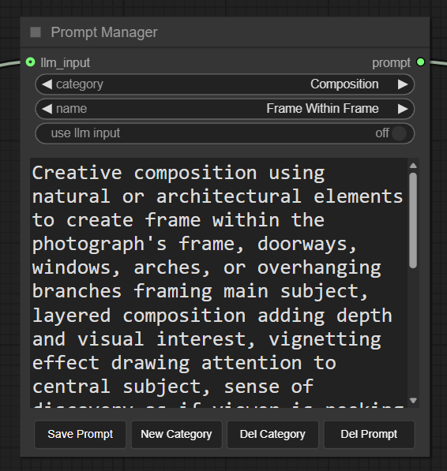
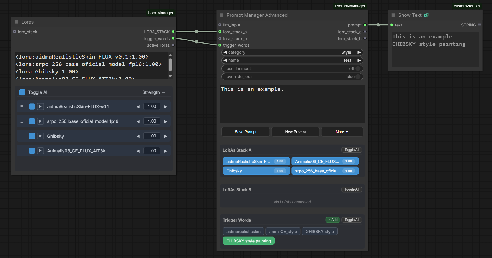

# ComfyUI Prompt Manager
## A comprehensive prompt toolkit for [ComfyUI](https://github.com/comfyanonymous/ComfyUI) — Save, Generate, and Extract prompts with full LoRA support.

A complete prompt management solution featuring three core capabilities:

**Prompt Manager** — Save and organize prompts with categories, simple UI with minimal feature.

**Prompt Manager Advanced** — Save and organize prompts with categories, complete with matching LoRA stacks, trigger words, and thumbnail previews. Supports dual LoRA stacks for complex workflows like Wan videos. Toggle LoRAs on/off or adjust strengths directly from saved presets. Will also remap Loras if path differs.

**Prompt Generator** — Generate and enhance prompts using local LLMs via [llama.cpp](https://github.com/ggerganov/llama.cpp). Supports text enhancement, image analysis with vision models (Qwen3VL), and thinking mode for deeper reasoning. Analyze up to 5 images at once.

**Prompt Extractor** — Extract prompts and LoRA configurations from existing images, videos, or JSON workflow files. Will extract first frame from any video. Automatically parses embedded metadata and outputs active LoRA as Lora stacks. When used in conjunction with Prompt Manager Advanced, Loras will be automatically found if available, regardless of path. For those that aren't, right click offers the option to look for them on Civitai.
___

<div align="center">
  <figcaption>Simple Prompt Generator Usage</figcaption>
  
</div>
<div align="center">
  <figcaption>Advanced Prompt Generator Usage</figcaption>
  
</div>
<div align="center">
  <figcaption>Prompt Manager Advanced, with Lora and trigger word support</figcaption>
  
</div>
<div align="center">
  <figcaption>Prompt Extractor connected to Manager Advanced, so workflow can be saved with Loras</figcaption>
  
</div>

### Key features:
### Prompt Manager:
- **Category Organization**: Create and manage multiple categories to organize your prompts
- **Save & Load Prompts**: Quickly save and recall your favorite prompts with custom names
- **LLM Input Toggle**: Connect text outputs from other nodes and toggle between using them or your internal prompts
- **LLM Input Toggle**: When in use, display of categories and prompt is disabled, allowing user to switch category and save.
- **Persistent Storage**: All prompts saved in your ComfyUI user folder

### Prompt Manager Advanced:
- **All Prompt Manager Features**: Everything from the basic Prompt Manager, plus LoRA and Trigger word integration
- **Prompt Thumbnails**: Save thumbnail images with your prompts for visual identification in the dropdown
- **Dual LoRA Stack Support**: Two separate LoRA stack inputs/outputs for complex workflows (e.g., Wan video with different LoRAs for image and video)
- **Visual LoRA Tags**: See connected LoRAs as clickable tags with strength values
- **Toggle LoRAs On/Off**: Click any LoRA tag to enable/disable it without disconnecting
- **Editable Strengths**: Click the strength value on any tag to adjust it inline
- **Trigger Words Support**: Save and display trigger words alongside prompts and LoRAs, can use [ComfyUI-Lora-Manager](https://github.com/infantesimone/ComfyUI-Lora-Manager) trigger words.
- **Right-Click to Delete**: Right-click any LoRA or trigger word tag to remove it
- **Save LoRAs with Prompts**: When you save a prompt, the current LoRA configuration is saved with it
- **Override Mode**: Toggle "Override Lora" to ignore connected inputs and use only saved preset LoRAs
- **Merge Mode**: When override is off, connected LoRAs are merged with saved presets
- **LoRA Manager Integration**: If [ComfyUI-Lora-Manager](https://github.com/infantesimone/ComfyUI-Lora-Manager) is installed, hovering over LoRA tags shows preview images
- **Missing LoRA Detection**: LoRAs that aren't found on your system are highlighted in red


### Prompt Apply LoRA:
- **Simple LoRA Application**: Takes a LORA_STACK and applies it to your model/clip
- **Works with Any Stacker**: Compatible with LoRA Manager's stacker or any node outputting LORA_STACK
- **Optional CLIP**: CLIP input is optional for workflows that don't need it

### Prompt Extractor:
- **Extract from Images/Videos**: Load images or videos and extract embedded prompts, LoRAs, and workflow metadata
- **JSON Workflow Support**: Browse and load JSON workflow files directly to extract prompts and LoRA configurations
- **Dual LoRA Stack Output**: Outputs two separate LoRA stacks for workflows using dual stacking (e.g., Wan video)
- **Active LoRA Filtering**: Only extracts LoRAs that are marked as active in the source workflow
- **Wide Node Compatibility**: Supports extraction from CLIP Text Encode, various sampler nodes, and LoRA stackers including Power Lora Loader
- **Preview in Manager**: View extracted data and repathed loras using Manager Advanced.

### Prompt Generator
- **Three Generation Modes**: Enhance text prompts, analyze images, or analyze images with custom instructions
- **Prompt Enhancement**: Transform basic prompts into detailed descriptions using local LLMs
- **Vision Analysis**: Analyze images with Qwen3VL models to generate detailed descriptions
- **Custom Image Analysis**: Provide your own instructions for image analysis
- **JSON Output**: Optional structured JSON output with scene breakdown
- **Thinking Support**: Support Thinking models to perform deeper generative reasoning.
- **Automatic Server Management**: Starts/stops llama.cpp server as needed, with automatic shut off at exit.
- **Smart Model Selection**: Auto-selects appropriate model (vision or text) based on mode or Thinking mode.

### Prompt Generator Options
- **Model Selection**: Choose from local models or download Qwen3, Qwen3VL and Qwen3VL Thinking models from HuggingFace
- **Auto-Download**: Automatically downloads both model and required mmproj files for vision models
- **LLM Parameters**: Fine-tune temperature, top_k, top_p, min_p, repeat_penalty and context size.
- **Custom Instructions**: Override default system prompt for different enhancement styles.
- **Extra Image Inputs**:  Combine up to 5 images to generate your prompt.
- **Console Debugging**: Enable outputing the entire process to the console for debugging purposes.

### Preference Options 
- Set choices for prefered Model for both base mode and VL model.
- Set new default model location, previous folder (gguf and llm) will still be scanned, but model will save in new default.
- Set custom Location for Llama.cpp. If Llama.cpp was not added to the system Path, this option let's you specify it's location.

### Save Video H264/H265
- **Codec Selection**: Choose between H.264 (8-bit, better compatibility) or H.265/HEVC (10-bit, better compression and gradients)
- **Chroma Subsampling**: Select yuv420 (most compatible), yuv422 (better for video editing), or yuv444 (best color, no chroma loss)
- **Quality Control**: Constant Rate Factor (CRF) from 0-51 for fine-tuned quality vs file size balance
- **Preview Mode**: Quick preview encoding to temp folder without saving to output
- **Save Latent**: Optionally save the latent alongside the video for later experimentation without regeneration
- **Audio Support**: Preserves audio from VIDEO input with proper sync
- **Workflow Metadata**: Embeds full workflow metadata in MP4 (unlike VideoHelperSuite which strips it from audio clips)
- **Browser Preview**: Automatically generates browser-compatible preview for H.265 + yuv422/444 combinations

### Animated Latent Preview
- **Video Sampling Preview**: Display animated previews during KSampler execution for video models
- **TAESD Support**: Works with both Latent2RGB and TAESD preview methods (including high-quality video TAESD)
- **Auto Frame Rate**: Automatically detects optimal playback rate based on video model (Wan, Mochi, LTXV, HunyuanVideo, etc.)
- **Manual Rate Override**: Optional playback rate override in preferences
- **VHS Compatible**: Automatically defers to VideoHelperSuite if installed to avoid conflicts

## Installation

1. Navigate to your ComfyUI custom nodes directory:
   ```
   cd ComfyUI/custom_nodes/
   ```

2. Clone this repository:
   ```bash
   git clone https://github.com/FranckyB/ComfyUI-Prompt-Manager.git
   ```
3. Install dependencies:
   ```bash
   cd ComfyUI-Prompt-Manager
   pip install -r requirements.txt
   ```
4. Install [llama.cpp](https://github.com/ggml-org/llama.cpp/tree/master)  
  Windows:
   ```bash
   winget install llama.cpp
   ```
   Linux:
   ```bash
   brew install llama.cpp
   ```
5. If you have them, place your .gguf models in the models/gguf folder or set in prererences your preferred folder path.

6. Restart ComfyUI

## Usage

### Prompt Manager

1. **Add the Node**: Add Node → Prompt Manager
2. **Select a Category**: Use the dropdown to choose from your categories
3. **Choose a Prompt**: Select a saved prompt from the name dropdown
4. **Connect prompt output**: Connect Prompt Manager output to your clip text encode node.

### Prompt Manager Advanced

1. **Add the Node**: Add Node → Prompt Manager → Prompt Manager Advanced
2. **Connect LoRA Stackers**: Connect LoRA stacker nodes (e.g., from LoRA Manager) to `lora_stack_a` and/or `lora_stack_b` inputs
3. **View LoRA Tags**: Connected LoRAs appear as clickable tags showing name and strength
4. **Toggle LoRAs**: Click a tag to enable/disable that LoRA (disabled tags turn gray)
5. **Adjust Strength**: Click the strength number on a tag to edit it inline
6. **Save with LoRAs**: Click "Save Prompt" to save both the prompt text and current LoRA configuration
7. **Override Mode**: Enable "Override Lora" checkbox to ignore connected inputs and use only the saved preset LoRAs
8. **Connect Outputs**: Use `lora_stack_a` and `lora_stack_b` outputs with the Apply LoRA Stack node

### Apply LoRA Stack

1. **Add the Node**: Add Node → Prompt Manager → Apply LoRA Stack
2. **Connect Model**: Connect your model (e.g., from Load Checkpoint) to the `model` input
3. **Connect LoRA Stack**: Connect a `LORA_STACK` output (from Prompt Manager Advanced or LoRA Manager's stacker)
4. **Optional CLIP**: Connect CLIP if your workflow needs it (some video workflows don't)
5. **Use Outputs**: Connect the modified model/clip to your sampler or other nodes

### Prompt Extractor

1. **Add the Node**: Add Node → Prompt Manager → Prompt Extractor
2. **Load Media**: Select an image or video from your input folder or use the upload button to access file from anywhere.
3. **JSON Workflows**: Support extracting from JSON, by importing workflow files directly using the upload button.
4. **Extract Data**: The node automatically extracts prompts, LoRAs, and trigger words from embedded metadata
5. **View Results**: Extracted positive/negative prompts display in the text outputs, LoRA stacks output as LORA_STACK
6. **Use with Manager**: Connect the LoRA stack outputs to Prompt Manager Advanced to view and save the extracted configuration

### Prompt Generator

**Basic Usage** (assuming a model is present in models\gguf):
1. **Add the Node**: Add Node → Prompt Generator
2. **Select Mode**: Choose from:
   - "Enhance User Prompt" - Improve text prompts with LLM
   - "Analyze Image" - Generate detailed image descriptions
   - "Analyze Image with Prompt" - Analyze images with custom instructions
3. **Connect inputs**: Connect image for vision modes, or just use text for enhancement mode
4. **Output as Json**: Use Format_as_Json to experiment with Json prompts.
5. **Push the LLM**: Use enable_thinking to enable the model to perform deeper generative reasoning before producing the final prompt.
4. **Save memory**: Toggle "stop_server_after" ON to free VRAM after generation
5. **Run Workflow**: Generated prompt displays and can be saved to Prompt Manager

**Advanced Usage**:
1. **Add the Options Node**: Add Node → Prompt Generator Options
2. **Connect Options**: Connect the options node to the Prompt Generator Options input
3. **Analyze multiple images**: Connect up to 4 additional images, for a total of 5.
4. **Select from available models**: Select from models found in your models\gguf folder. Qwen models will be available to download.
5. **Adjust settings**: Adjust LLM parameters (temperature, top_k, etc.)
6. **Customize LLM**: Customize the default LLM instructions to modify the responses llama returns.
7. **Enable Debugging**: Enable complete printout of process to console using show_everything_in_console

**Qwen models found in options**
- Qwen3-1.7B-Q8_0.gguf: Fastest, lowest VRAM (~2GB)
- Qwen3-4B-Q8_0.gguf:   Balanced performance (~4GB VRAM)
- Qwen3-8B-Q8_0.gguf:   Best quality, highest VRAM (~8GB)
- Qwen3VL-4B-Instruct-Q8_0.gguf: Vision model, balanced performance (~5GB VRAM)
- Qwen3VL-8B-Instruct-Q8_0.gguf: Vision model, best quality (~9GB VRAM)
- Qwen3VL-4B-Thinking-Q8_0.gguf: Vision model, Thinking variant, balanced performance (~5GB VRAM)
- Qwen3VL-8B-Thinking-Q8_0.gguf: Vision model, Thinking variant, best quality (~9GB VRAM)

**Model Management**:
- Place gguf files in models/gguf folder
- Downloaded models are also placed in this folder.

**Preferences**:
Preference settings can be found in ComfyUI Settings → Prompt Manager
- **Preferred Base Model**: Name of model used for "Enhance User Prompt" mode (text-only models)
- **Preferred Vision Model**: Name of model Used for "Analyze Image" modes (Qwen3VL models)
- **Set Default Port** You can set the port used by Llama.cpp
- **Close Llama on Exit** By default Llama.cpp with be close on exit.

### Save Video H264/H265

1. **Add the Node**: Add Node → Prompt Manager → Save Video H264/H265
2. **Connect VIDEO**: Connect a VIDEO output (e.g., from VAE Decode for video models)
3. **Choose Codec**: Select h264 for compatibility or h265 for better quality/compression
4. **Set Quality**: Adjust CRF (18-23 recommended for high quality, lower = better quality but larger files)
5. **Chroma Options**: Use yuv420 for maximum compatibility, yuv444 for best color preservation
6. **Save Latent**: Connect a LATENT input and enable "save_latent" to save the latent alongside your video
7. **Preview Mode**: Set "save" to false for quick preview encoding without saving to output folder

### Animated Latent Preview

1. **Enable in Settings**: Go to ComfyUI Settings → Prompt Manager → 5. Video Sampling
2. **Toggle On**: Enable "Display animated previews when sampling"
3. **Optional Rate**: Set "Playback rate override" to force a specific FPS (0 = auto-detect from model)
4. **Run Video Workflow**: During KSampler execution, you'll see an animated preview of the video being generated
5. **Works with TAESD**: Enable TAESD in ComfyUI preview settings for higher quality previews

**Note**: If VideoHelperSuite is installed and enabled, its latent preview takes priority to avoid conflicts.

## Requirements

- ComfyUI
- Python 3.8+
- requests >= 2.31.0
- huggingface_hub >= 0.20.0
- psutil >= 5.9.0
- tqdm >= 4.66.0
- Pillow >= 10.0.0
- colorama
- llama-server (from llama.cpp)

## Troubleshooting

**Problem**: Prompts don't appear in the dropdown
- **Solution**: Make sure the category has saved prompts. Try creating a new prompt first.

**Problem**: Changes aren't saved
- **Solution**: Click the "Save Prompt" button after making changes. Direct edits in the text field are temporary.

**Problem**: Can't see LLM output in the node
- **Solution**: Make sure the LLM output is connected to the "llm_input" and run the workflow.

**Problem**: "llama-server command not found"
- **Solution**: Install llama.cpp and make sure `llama-server` is available in command line. See [llama.cpp releases](https://github.com/ggerganov/llama.cpp/releases)

**Problem**: "No models found"
- **Solution**: Either place a .gguf file in the `models/` folder, or connect the Prompt Generator Option node and select a model size (1.7B, 4B, or 8B) to download from HuggingFace

**Problem**: Server won't start
- **Solution**: Check that port 8080 is not in use. Close any existing llama-server processes.

**Problem**: Model download fails
- **Solution**: Check your internet connection and HuggingFace availability. Large models may take time to download.

**Problem**: Generation is slow
- **Solution**: Either, Use a smaller quantized model (Q4 instead of Q8) or toggle 'stop_server_after' to quit llama.cpp after generating prompt.

**Problem**: Default Model used is not what I want
- **Solution**: You can set your preferred model in the ComfyUI settings. Simply add its full name, with .gguf extension, for both the VL and base models. Enabling Thinking in the Generator might change what is used for VL models.


## Changelog

### version 1.15.8
- **Bug Fixes**
  - Improved Prompt Extractor, enhanced detection logic

### version 1.15.7
- **Added Rename Category Option**
- **Bug Fixes**

### version 1.15.6
- **Video Metadata Reader - VHS Compatible**
   - Added capability to read metadata from VideoHelperSuite generated videos.

### version 1.15.5
- **Added get video components+ node**
  - Since our save video node can saves latents, this also returns the matching latent (if found) and filepath.
- **Video Preview in Prompt Extractor**
  - Added the option to preview in fullscreen with dark overlay for both images and video on the Prompt Extractor node.

### version 1.15.0
- **Added Animated Latent Preview**
- Added Similar option to VideoHelperSuite, to display animated Latent preview. With the addition that it works in TAESD mode.
- Check for VideoHelperSuite node, so not to conflict with it. (Will do nothing if installed)

### version 1.14.5
- **Added Save Latent support to Save Video node**
- allows to save the full data of a generation to then experiment without the need to regenerate.
- added some very quick workflow examples.
    -A simplified version of my Wan workflow
    -A basic Z-Image base workflow with Prompt Generator.
- Small bug fixes    

### version 1.14.0
- **Addition of a "Save Video H264/H265" node, that replicates ComfyUI's Video Node**
  - Adds choice between H264/H265
  - Choice of Chroma Subsampling between yuv420, yuv422, yuv444
  - Can set Constant Rate Factor (compression level)
  - Generates a quick proxy video if chosen format could not play in browser (H265 + yuv422 or H265 + yuv444)
  - Unlike VideoHelperSuite, clip with Audio also include Metadata. Which can then be used with Prompt Extractor.

### version 1.13.5
- Added browse window with thumbnails in Extractor, with cache system for speedup.
- Bug fix for issue caused by new additions.

### version 1.12.7
- Quality of life improvements and added option to change the Strenght of any Lora in Manager, so we can tweak Extracted Workflows Live.

### version 1.12.6
- Tweak to caching behavior for prompt extractor and prompt manager advanced

### version 1.12.5
- Some dependencies to FFMpeg were still present, remove them and added a frame_position value, so we can specify what frame to get from video.

### version 1.12.0
- Prompt Extractor: Added Lora inputs, so it can be used as a passthrough, with a None Choice at top, to easily deactivate it.
- Prompt Extractor: Improved logic for determining Positive prompts in Worfklow.
- Prompt Extractor: Improved logic for finding High and Low Lora Stacks
- Prompt Manager Advanced: Added Fuzzy Logic to find Loras that might have been renamed
- Prompt Manager Advanced: Fixed issue of Lora buttons getting cleared when changing tab.

### Version 1.11.5
- Slight adjustement to extractor node, gets metadata in a method more consistent with ComfyUI, removing need for ffmpeg for videos.

### Version 1.11.2
- Slight adjustement to extractor node to behave exactly like the Load image node, while also supporting Videos. (With extract first frame support)

### Version 1.11.0
- **New Node: Prompt Extractor** - Extract prompts and LoRA configurations from images, videos, and JSON workflows
  - Loads embedded metadata from PNG, JPEG, WebP images and MP4 videos
  - Browse and load JSON workflow files directly
  - Dual LoRA stack output for workflows using two stacks (e.g., Wan video)
  - Filters inactive LoRAs - only extracts LoRAs marked as active
  - Supports extraction from CLIP Text Encode, samplers, and LoRA stackers
  - Compatible with Power Lora Loader, WanMoeKSamplerAdvanced, and other common nodes
- **Prompt Thumbnails** - Save thumbnail images with prompts in Prompt Manager Advanced
  - Visual identification of prompts in the dropdown selector
  - Thumbnails stored alongside prompt data for easy management
- **Simplified "New Prompt" button**
  - Now clears fields immediately without asking for a name
  - Enter the name when saving instead of when creating
  - Keeps you in the current category for faster workflow
- **Bug fixes and improvements**
  - Fixed JSON workflow file path resolution
  - Improved LoRA extraction for complex workflows

### Version 1.10.0
- **Unified UI for Prompt Manager and Prompt Manager Advanced**
  - Three-button layout: Save Prompt, New Prompt, and More (dropdown menu)
  - New Prompt button creates a temporary prompt that isn't saved until you click Save Prompt
  - Save Prompt opens a modal with category selection (create new or select existing)
  - More dropdown includes: Import JSON, Export JSON, Delete Prompt, Delete Category
- **Import/Export JSON functionality**
  - Export all prompts to a JSON file
  - Import prompts with Merge (add to existing) or Replace (overwrite all) options
  - Proper cancel handling without false success messages
- **Multi-tab synchronization**
  - Changing category or prompt reloads data from server
  - Prevents conflicts when editing prompts in multiple browser tabs
- **Prompt Manager now preserves LoRA data**
  - LoRA stacks, trigger words, and active states are preserved when saving from basic Prompt Manager
  - Seamless compatibility between Prompt Manager and Prompt Manager Advanced
- **Trigger Words support in Prompt Manager Advanced**
  - Save and restore trigger words alongside prompts and LoRAs
  - Trigger words display as editable text when loading saved prompts
- **Improved unsaved changes detection**
  - Warning when switching away from newly created (unsaved) prompts
  - Cancel button properly reverts dropdown to previous selection

### Version 1.9.0
- **New Node: Prompt Manager Advanced** - Extended prompt manager with LoRA stack support
  - Dual LoRA stack inputs/outputs for complex workflows (Wan video, etc.)
  - Visual LoRA tags showing name and editable strength values
  - Toggle LoRAs on/off by clicking tags
  - Save LoRA configurations alongside prompts
  - Override mode to ignore connected inputs and use saved presets
  - Merge mode combines connected LoRAs with saved presets
  - Missing LoRA detection with visual warnings
  - Integration with LoRA Manager for hover previews
- **New Node: Apply LoRA Stack** - Simple node to apply LORA_STACK to model/clip
- Categories and prompts now display in alphabetical order
- Fixed dropdown refresh after saving prompts

### Version 1.8.3
- Added option to leave Llama server running when closing ComfyUI.

### Version 1.8.2
- Added custom model path preference and enhance model management

### Version 1.8.1
- Added option to set a custom Llama path in preferences, for those that have specific installs.

### Version 1.8.0
- Added support for Qwen3VL Thinking model variants, with download options thru the Generator Options node.
- Model manager now searches for relevant `mmproj` files using model-name components for more reliable vision-model linking.
- Detailed console output options (debug logging)
- `enable_thinking` toggle to enable/disable the model's reasoning/thinking mode.
- Options node now accepts multiple images for analysis.
- Better Llama shutdown behavior to force-close the server when Comfy exits.
- Uses model-reported sampling params by default when available; the Options node can override them per-parameter.
- Moved preference API endpoints and cache handling into `model_manager.py` for cleaner management and persistence.

### Version 1.7.0
- Added three-mode prompt generator: "Enhance User Prompt", "Analyze Image", "Analyze Image with Prompt"
- Enhanced vision model workflow with dedicated image analysis modes
- Added custom image analysis with user-provided instructions (e.g., "describe the lighting", "identify objects")
- Added model preferences system integrated with ComfyUI Settings
- Added automatic model preference management (separate settings for base and vision models)
- Improved model selection with preference fallback to smallest model
- Filtered mmproj files from model selection dropdowns
- Model preferences stored in ComfyUI settings for persistence across updates

### Version 1.6.0
- Added Qwen3VL vision model support for image analysis
- Added JSON output format option with structured scene breakdown
- Added adjustable context size parameter (512-32768 tokens)
- Added automatic mmproj file download for vision models
- Added image resizing to ~2MP to optimize token usage
- Added token usage logging for monitoring context consumption
- Improved model selection logic with automatic VL/non-VL detection
- Fixed multiple directory support for model search (gguf + LLM folders)

### Version 1.5.1
- LLM output remains available when use_llm is off, so it can be edited.
- Improved caching detection: any change to options will be detected and force a new output.
- Improved some UI quirks

### Version 1.5.0
- Added Prompt Generator node with automatic llama.cpp server management
- Added Prompt Generator Options node for model selection and parameters
- Automatic model detection and auto-download from HuggingFace for Qwen3 models.
- VRAM management with optional server shutdown

### Version 1.1.0
- Added LLM input toggle for switching between internal and external text
- Made text fields scrollable even when disabled
- Fixed reload bugs with toggle state

### Version 1.0.0
- Initial release
- Category and prompt management
- LLM output integration
