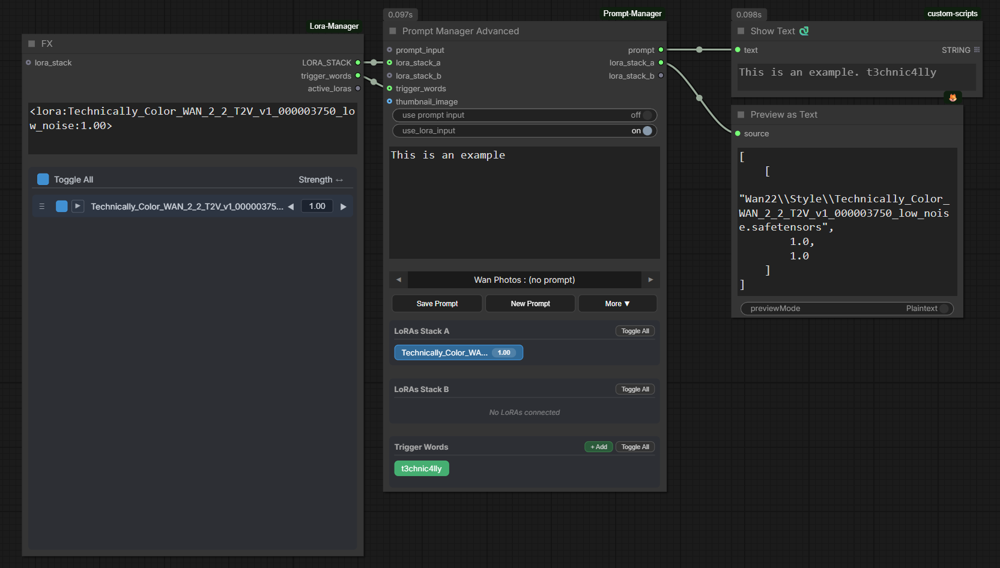
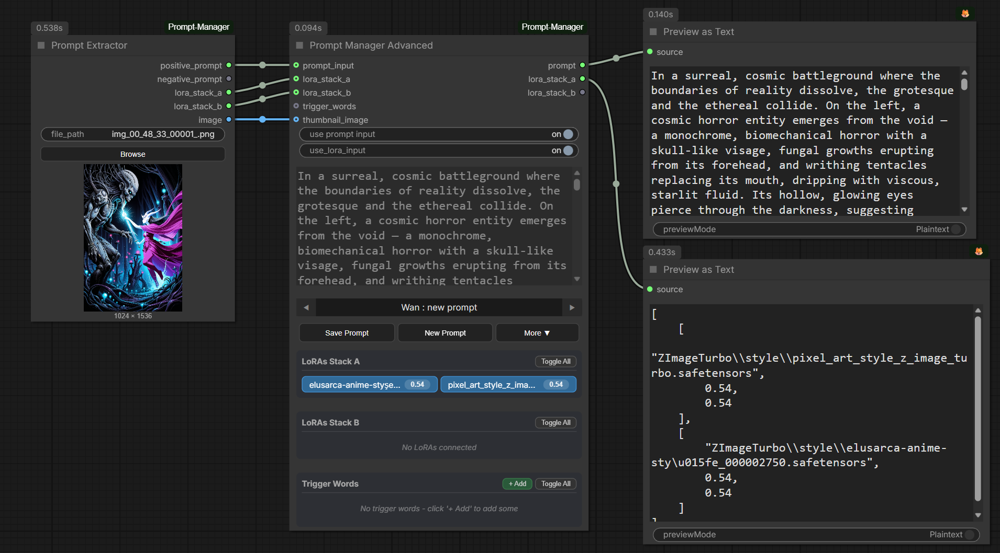
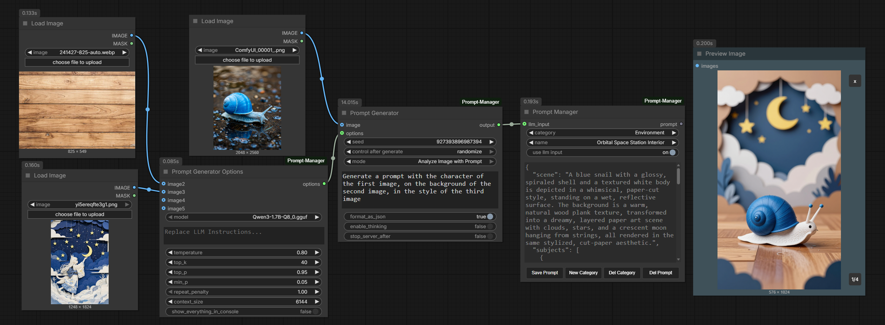
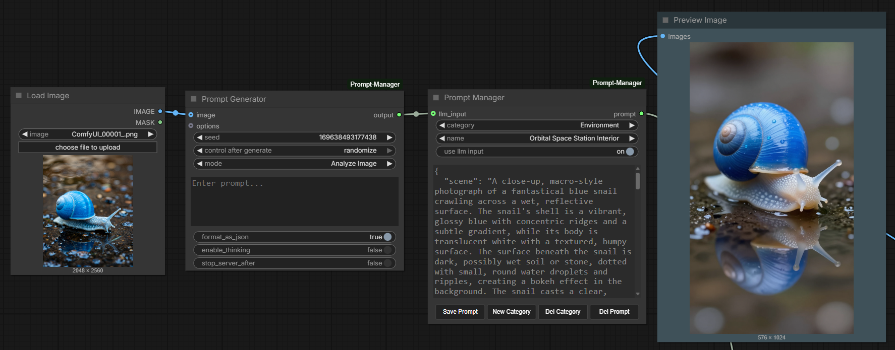
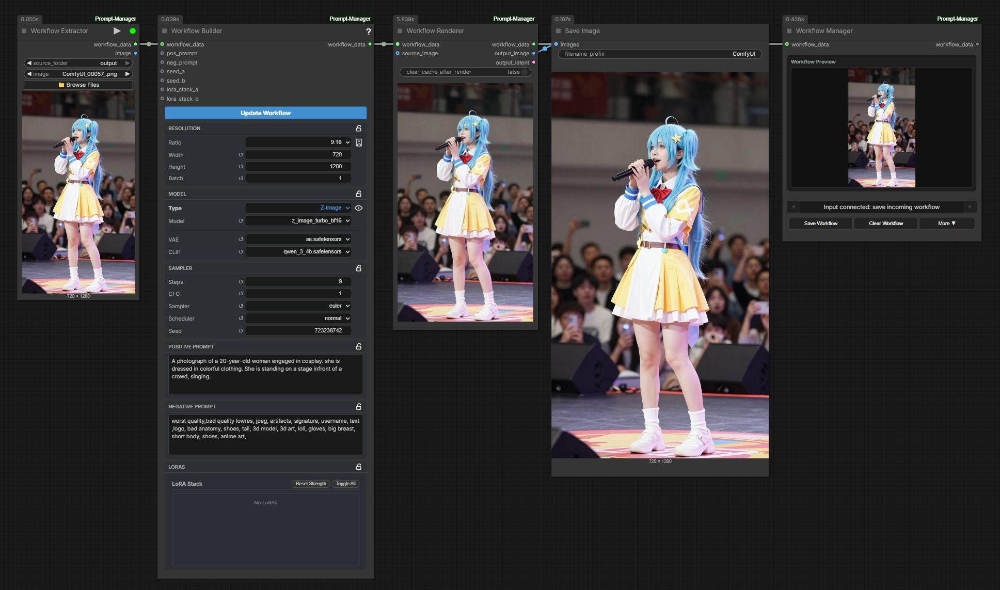

# ComfyUI Prompt Manager
## A comprehensive prompt and recipe toolkit for [ComfyUI](https://github.com/comfyanonymous/ComfyUI)

ComfyUI Prompt Manager is an all-in-one prompt and recipe toolkit for ComfyUI, built for both creating recipes from scratch and extracting reusable setups from images, videos, and workflows.
It includes local LLM-powered prompt generation (llama.cpp or Ollama), LoRA stack tooling, and end-to-end Recipe nodes to build, edit, render, save, and reuse repeatable generation pipelines.

> **Naming Update (v2.x):**
> We have shifted from using the term "Workflow" to "Recipe" for this toolset.
> This is an unfortunate but needed naming change to better represent the purpose of this tool.

## What This Provides

- **Prompt tools**: Prompt Manager, Prompt Manager Advanced, Prompt Extractor
- **Recipe tools**: Recipe Extractor, Recipe Builder, Recipe Renderer, Recipe Relay, Recipe Model Loader, Recipe Manager
- **Local LLM support**: Prompt Generator + Prompt Generator Options using llama.cpp or Ollama
- **LoRA workflow support**: dual stack editing, toggles, strength control, missing LoRA detection
- **Family support**: Flux 1/2, Ernie, SDXL, Wan, Qwen, Z-Image, Wan Image, Wan Video (I2V/T2V)

## Quick Start

1. Extract or build recipe data.
2. Edit and validate in Recipe Builder.
3. Render with Recipe Renderer.
4. Save and reuse with Recipe Manager.

## Screenshots

<div align="center">
  <figcaption>Prompt Manager Advanced, with LoRA and trigger word support</figcaption>
  
</div>
<div align="center">
  <figcaption>Prompt Extractor connected to Prompt Manager Advanced</figcaption>
  
</div>
<div align="center">
  <figcaption>Advanced Prompt Generator</figcaption>
  
</div>
<div align="center">
  <figcaption>Simple Prompt Generator</figcaption>
  
</div>
<div align="center">
  <figcaption>Recipe Builder</figcaption>
  
</div>

## Documentation

- Detailed node and feature reference: [docs/feature-reference.md](docs/feature-reference.md)
- Full changelog history: [docs/changelog.md](docs/changelog.md)

## Installation

1. Navigate to your ComfyUI custom nodes directory:
   ```
   cd ComfyUI/custom_nodes/
   ```
2. Clone this repository:
   ```bash
   git clone https://github.com/FranckyB/ComfyUI-Prompt-Manager.git
   ```
3. Install dependencies:
   ```bash
   cd ComfyUI-Prompt-Manager
   pip install -r requirements.txt
   ```
4. Install [llama.cpp](https://github.com/ggml-org/llama.cpp/tree/master):
   - Windows:
     ```bash
     winget install llama.cpp
     ```
   - Linux:
     ```bash
     brew install llama.cpp
     ```
5. Place `.gguf` models in your preferred models folder (or configure one in settings).
6. Restart ComfyUI.

## Requirements

- ComfyUI
- Python 3.8+
- requests
- huggingface_hub
- psutil
- tqdm
- Pillow
- colorama
- llama-server (from llama.cpp)
