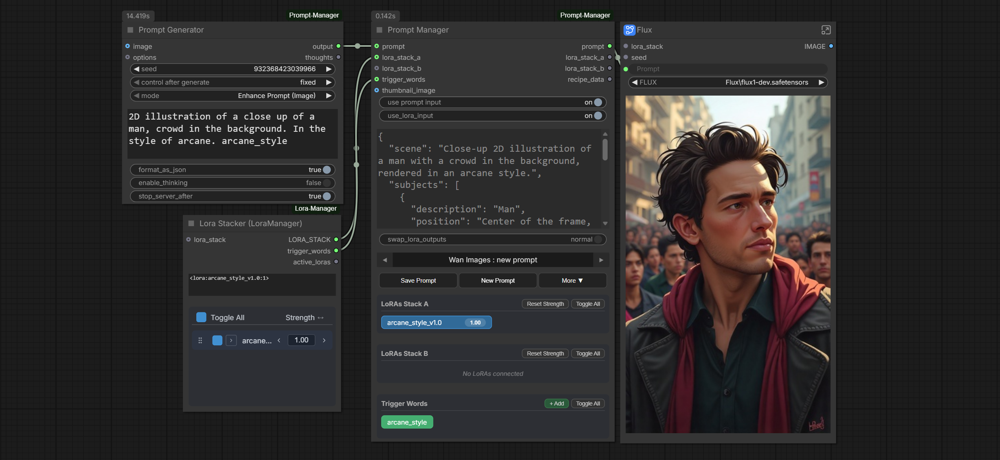
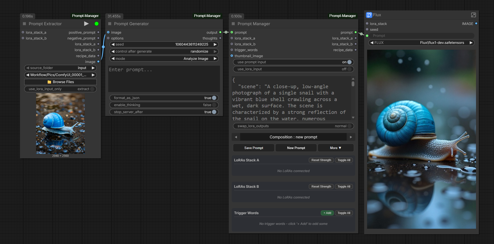
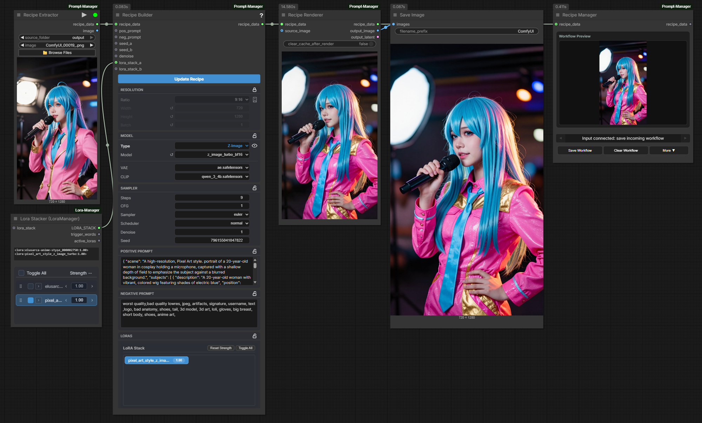
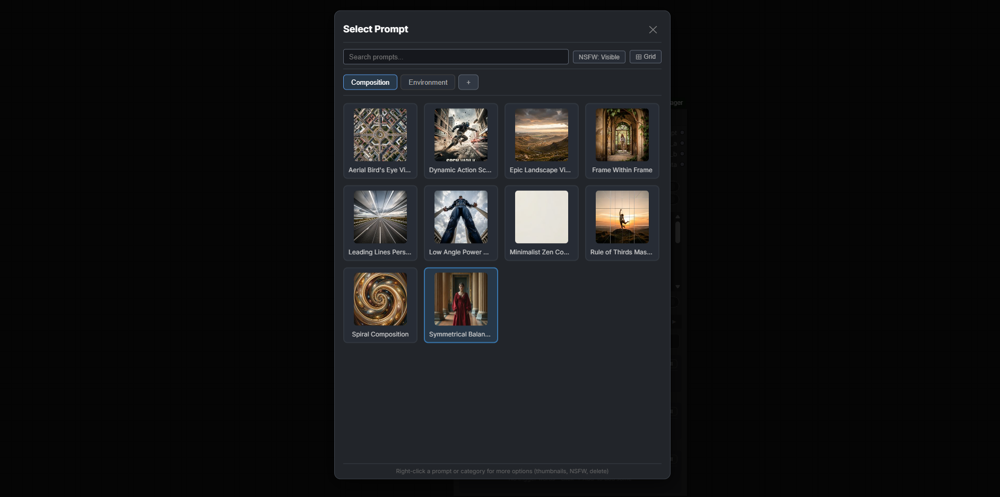
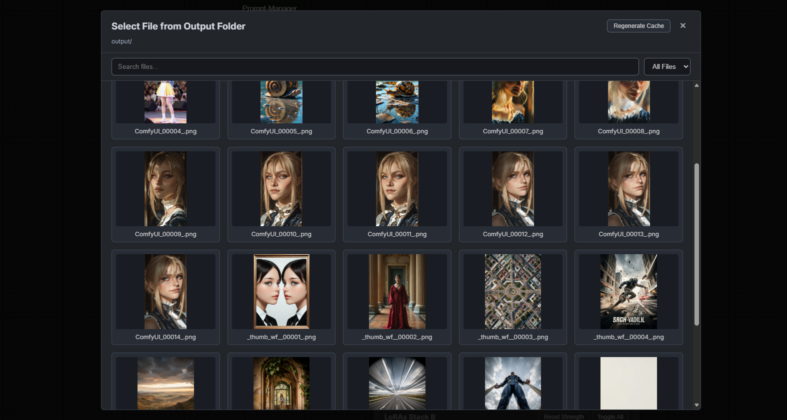

# ComfyUI Prompt Manager
## A comprehensive prompt and recipe toolkit for [ComfyUI](https://github.com/comfyanonymous/ComfyUI)

ComfyUI Prompt Manager is an all-in-one prompt and recipe toolkit for ComfyUI, built for creating recipes from scratch or by extracting core workflow elements from Images and Videos with embedded workflows. It includes local LLM-powered prompt generation (llama.cpp or Ollama) with automatic download of Qwen3.5 models, LoRA stack tooling, and end-to-end Recipe nodes to build, edit, render, save, and reuse repeatable generation pipelines. It can extract core metadata from media generated in ComfyUI, A1111, and Forge, supporting Wan Workflows with dual model/stack support.

> **Naming Update (v2.1):**
> We have shifted from using the term "Workflow" to "Recipe" for this toolset.
> This is an unfortunate but needed naming change to better represent the purpose of this tool.

> **New in v2.5.0:**
> Recipe Builder can now setup Multi Model all in one Node. Gone is the need to stack multiple Builder nodes when setting multi model workflows.
> You can build and route `model_a` through `model_d` in one node, keep per-slot prompts/LoRAs/sampler data, and extract Builder-authored recipes from media with v2 metadata preserved as the authoritative source.
> Added a New Multi Lora Stack node, that is based on Lora-Manager and works with it.  Simply select the column you want to add to and then added loras with be added to it.
> This new Multi Model may break combatibility wirh previous workflows, but this is now MUCH closer to the initial visioin!  One node to build the entire Recipe.

## What This Provides

- **Prompt tools**: Prompt Manager, Prompt Extractor
- **Local LLM support**: Prompt Generator using llama.cpp or Ollama. Supports text enhancement and image analysis with vision models (Qwen3.5)
- **Recipe tools**: Recipe Extractor, Recipe Builder, Recipe Builder (WAN), Recipe Hub, Recipe Relay, Recipe Renderer, Recipe Model Loader, Recipe Manager
- **LoRA workflow support**: Display and modify added Loras. When reusing Saved presets, values can still be changed.
- **Model support**: Recipe Renderer supports: Flux 1/2, Ernie, SDXL, Wan, Qwen, Z-Image, Wan Image, Wan Video (I2V/T2V)
- **Lora Preview**: When [Lora-Manager](https://github.com/willmiao/ComfyUI-Lora-Manager) is installed, LoRAs can be previewed on hover.
- **Prompt Browser**: Includes a Browser to easily find and select your prompts or Recipes.
- **Advance Image Loader**:  Extractors can serve as advanced Image loaders, loading from Input or Ouput.
---

<div align="center">
  <figcaption>Prompt Creation With Lora and Trigger Words</figcaption>
  
</div>

<div align="center">
  <figcaption>Generating Prompts based on Images</figcaption>
  
</div>

<div align="center">
  <figcaption>Advanced Prompt Generation using Multiple Images</figcaption>
  
</div>

<div align="center">
  <figcaption>Recipe extraction and modifcation (Adding a Style Lora)</figcaption>
  
</div>

<div align="center">
  <figcaption>Easily find saved Prompts & Recipe using the Built-in File Browser</figcaption>
  
</div>

<div align="center">
  <figcaption>Use Extractor Nodes as an Image Loader, allowing browsing from Input and Output folder.</figcaption>
  
</div>


## v2.0 Introduces The Recipe Toolset

Version 2.x introduces a Recipe toolset that can be used on its own, or in combination with the Prompt toolset.

- Use the Recipe toolset when you want repeatable generation pipelines from extracted or hand-edited recipe data.
  - Recipe Data includes prompts (pos & neg), LoRA stack, mode used, KSampler settings, resolution, seed, and more.
  - This data can be created using Recipe Builder or extracted from existing media with Recipe Extractor.
  - Recipe Renderer provides an easy way to render this recipe.
  - Recipe data can also be used traditionally with the Recipe Relay node, which can access all of it.
- Use the Prompt toolset when you want fast prompt library management and local LLM-assisted prompt creation.
  - Prompt Generator allows creation of new prompts using the LLM model of your choice.
  - Prompt Manager can save these to be reusable later.
  - Prompt Extractor is similar to Recipe Extractor, but can individually output prompts or LoRAs.
- Use both together when you want to create Recipes, but use different prompts.

In short: Prompt tools help you author and manage Prompts + LoRA intent, while Recipe tools help you build, execute and reuse full generation configurations.

## Toolset Overview

### Prompt Toolset

- Prompt Manager: dual LoRA stacks, trigger words, thumbnail workflows, and advanced save flows.
- Prompt Extractor: reads metadata from images/videos/JSON and outputs prompt + LoRA + recipe context.
- Prompt Generator + Options: local LLM prompt creation and enhancement using llama.cpp or Ollama.
- Prompt Manager (Basic): category-based prompt save/load. A no-frills basic version (The OG).

### Recipe Toolset

- Recipe Extractor: normalizes extracted metadata into reusable recipe_data.
- Recipe Builder: edit and validate recipe_data in a cleaner authoring surface.
- Recipe Renderer: execute recipe_data through built-in generation templates.
- Recipe Hub: merge/append model blocks into one `recipe_data` and expose each model block as its own output.
- Recipe Relay: edit one model block (`model_data`) with seed and LoRA stack overrides.
- Recipe Model Loader: resolve and load models from recipe_data.
- Recipe Manager: save and reuse recipe entries.

## Common Pipelines

### Prompt-first Pipeline

1. Write or generate prompts and connect LoRA stacks into Prompt Manager.
2. Generate with your normal ComfyUI graph.
3. Save reusable prompt entries when satisfied.

### Recipe-first Pipeline

1. Create preset in Recipe Builder
  - By extracting recipe_data from media or JSON, using Recipe Extractor
   - Or by directly modifying Recipe Builder to the values you want.
2. Render in Recipe Renderer.
3. Save reusable recipe entries with Recipe Manager.
   - To include Thumbnail, add after the Renderer node.

### Hybrid Pipeline

1. Extract or build recipe_data.
2. Add Prompt Generator or Save prompts into Builder.
3. Add LoRAs, either using LoRA stackers or saved LoRA stacks in Prompt Manager.
4. Render through Recipe Renderer.
5. Save final reusable entries in Recipe Manager.

## Preferences And Settings

- Addon settings are available in ComfyUI Preferences (Settings) under Prompt Manager.
- This is where you set model/backend defaults, NSFW visibility defaults, view preferences, and related addon behavior.
- Prompt Generator backend choices (llama.cpp or Ollama) and related options are configured there.

## Workflow Examples

Workflow examples are provided to help understand the basics.

## Documentation

- Detailed node and feature reference: [docs/feature-reference.md](docs/feature-reference.md)
- Full changelog history: [docs/changelog.md](docs/changelog.md)

## Installation

1. Navigate to your ComfyUI custom nodes directory:
   ```
   cd ComfyUI/custom_nodes/
   ```
2. Clone this repository:
   ```bash
   git clone https://github.com/FranckyB/ComfyUI-Prompt-Manager.git
   ```
3. Install dependencies:
   ```bash
   cd ComfyUI-Prompt-Manager
   pip install -r requirements.txt
   ```
4. Install [llama.cpp](https://github.com/ggml-org/llama.cpp/tree/master):
   - Windows:
     ```bash
     winget install llama.cpp
     ```
   - Linux:
     ```bash
     brew install llama.cpp
     ```
5. Place custom `.gguf` models in models/gguf.
   - Or use preferences to set a custom path.
6. Restart ComfyUI.

## Requirements

- ComfyUI
- Python 3.8+
- requests
- huggingface_hub
- psutil
- tqdm
- Pillow
- colorama
- llama-server (from llama.cpp)
