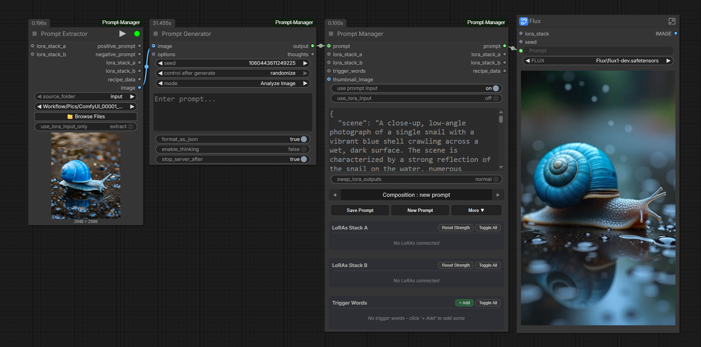
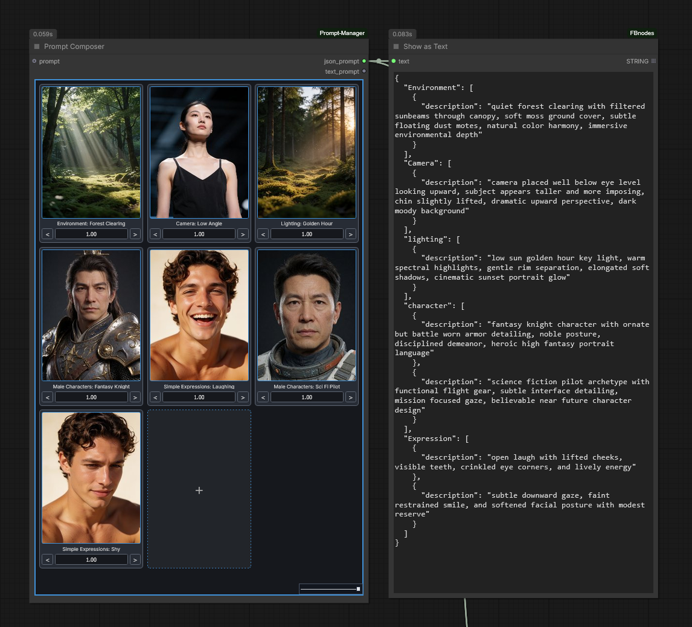
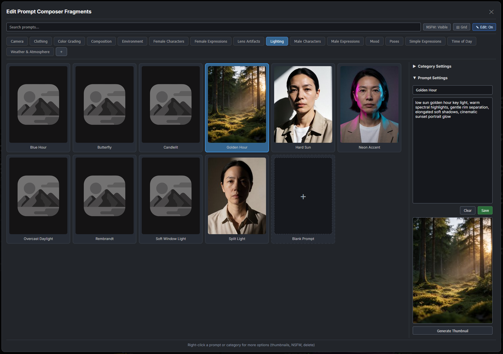

# ComfyUI Prompt Manager
## A comprehensive prompt and recipe toolkit for [ComfyUI](https://github.com/comfyanonymous/ComfyUI)

ComfyUI Prompt Manager is a prompt toolkit for ComfyUI focused on writing, generating, extracting, organizing, and reusing prompts with LoRA-aware workflows. It includes prompt generation powered by local LLM (llama.cpp or Ollama) or direct generation using ComfyUI's own CLIP/text encoders, automatic download of Qwen3.5 models, metadata extraction from images/videos/JSON, prompt browser tooling, and advanced prompt save/load flows. 

[See Installation Guide](#installation)
[See Node Reference](docs/feature-reference.md)
[See latest update](#latest-update)

## What This Provides

- **Prompt authoring and management**: Prompt Manager (Advanced + Basic) for prompt save/load workflows, LoRA stacks or Multi Lora Stacks, trigger words, expressions, and reusable prompt libraries.
- **Prompt generation**: Prompt Generator + Prompt Generator Options can run through a local LLM (llama.cpp or Ollama), or directly through a connected ComfyUI CLIP/text encoder. Supports text enhancement and image-based analysis (Qwen3.5 vision models when using the LLM backend).
- **Prompt and metadata extraction**: Prompt Extractor reads metadata from images/videos/JSON and can output prompt, LoRA, and recipe context.
- **Prompt browsing utilities**: Browser tools to quickly find and load saved prompts or recipes, with Grid, Icon, and List views.
- **LoRA workflow support**: Multi-LoRA stack tooling and editable LoRA data when reusing saved entries.
- **Optional full Recipe toolkit**: Recipe Builder, Recipe Extractor, Recipe Relay, Recipe Renderer, Recipe Model Loader/Picker, and Recipe Manager for complete generation pipelines.
- **Model-aware recipe rendering**: Recipe Renderer supports Flux 1/2, Ernie, SDXL, Wan, Qwen, Z-Image, Krea2, Wan Image, and Wan Video (I2V/T2V).
- **Lora Preview integration**: When [Lora-Manager](https://github.com/willmiao/ComfyUI-Lora-Manager) is installed, LoRAs can be previewed on hover.
- **Advanced media loading**: Extractor nodes can also act as advanced image loaders from Input and Output folders.
---

<div align="center">
  <figcaption>Prompt Creation With Lora and Trigger Words</figcaption>
  
</div>

<div align="center">
  <figcaption>Generating Prompts based on Images</figcaption>
  
</div>

<div align="center">
  <figcaption>Advanced Prompt Generation using Multiple Images</figcaption>
  
</div>

<div align="center">
  <figcaption>Recipe extraction and modifcation (Adding a Style Lora)</figcaption>
  
</div>

<div align="center">
  <figcaption>Easily find saved Prompts & Recipe using the Built-in File Browser</figcaption>
  
</div>


## Toolset Overview

### Prompt Toolset

- Prompt Manager: Supports Prompts, LoRA stacks, trigger words and thumbnail for workflows.
- Prompt Manager (Basic): Simple no-frills basic version (The OG).
- Prompt Generator: prompt creation and enhancement using llama.cpp, Ollama, or a connected ComfyUI CLIP/text encoder.
- Prompt Extractor: Reads metadata from images/videos/JSON and outputs prompt + LoRA + recipe context.
- Prompt Compose: A tool to apply re-usable prompts to your prompts, be it expressions, actions, etc..
- Prompt Browser: A node meant to allow access and write prompts for:
  - System Prompts used by Prompt Generator.
  - Compose Data used by the Prompt Compose.
  - Prompt Data used by our Prompt Manager.

### Recipe Toolset (Experimental)
These tools where an experiment, with some of the tech now used in other parts of the add-on.
- Recipe Extractor: normalizes extracted metadata into reusable recipe_data.
- Recipe Builder: edit and validate recipe_data in a cleaner authoring surface.
- Recipe Renderer: execute recipe_data through built-in generation templates.
- Recipe Hub: merge/append model blocks into one `recipe_data` and expose each model block as its own output.
- Recipe Relay: edit one model block (`model_data`) with seed and LoRA stack overrides.
- Recipe Model Loader: resolve and load models from recipe_data.
- Recipe Manager: save and reuse recipe entries.

## Workflow Examples

Workflow examples are provided to help understand the basics.

## Preferences And Settings

- Addon settings are available in ComfyUI Preferences (Settings) under Prompt Manager.
- This is where you set model/backend defaults, NSFW visibility defaults, view preferences, and more.
- Prompt Generator backend choices (llama.cpp, Ollama) and related options are configured there.
- The Prompt Generator's system prompts are fully user-customizable. They're stored in `user/default/prompt_generator_data.json` and can be created and edited with the **Prompt Browser** — your custom prompts then show up directly in the Prompt Generator node. (Press r for refresh if not visible)

## Documentation

- Detailed node reference: [docs/feature-reference.md](docs/feature-reference.md)

## Latest update
- First draft of a new Prompt Compose system is now included.
- This first draft is functional and usable today, though the provided default prompts still need refinement.
- Prompt Compose replaces the Expression Selector node and expands on it significantly: it still handles expression-style prompt appending, but also adds a broader prompt composition workflow with category/prompt management and editing tools.  Prompt Compose also support random generation, selecting multiple prompts with randomly select one.
- New Prompt Compose Manager is provided to add new prompts and categories.

<div align="center">
  <figcaption>Use Prompt Compose to generate Prompt from preset fragments</figcaption>
  
</div>

<div align="center">
  <figcaption>Prompt Browser now allows for direct Editing</figcaption>
  
</div>


The new **Prompt Browser** lets you create and edit all three prompt libraries from a single interface:
  - **System prompts**: the instructions that steer the Prompt Generator's LLM
  - **Compose prompts**: Prompt Composer fragments
  - **Prompt Manager prompts**: your saved user prompts

System prompts now feed straight into the **Prompt Generator**, so you can author your own and pick them right in the node. Sample system prompts ship in the node's `/prompts` folder to get you started, and the original built-in prompts are always restored automatically if they're ever missing — they're sourced from `basic_system_prompts.json`, so your edits never cost you the defaults.

## Installation

1. Navigate to your ComfyUI custom nodes directory:
   ```
   cd ComfyUI/custom_nodes/
   ```
2. Clone this repository:
   ```bash
   git clone https://github.com/FranckyB/ComfyUI-Prompt-Manager.git
   ```
3. Install dependencies:
   ```bash
   cd ComfyUI-Prompt-Manager
   pip install -r requirements.txt
   ```
4. Install [llama.cpp](https://github.com/ggml-org/llama.cpp/tree/master):
   - Windows:
     ```bash
     winget install llama.cpp
     ```
   - Linux:
     ```bash
     brew install llama.cpp
     ```
5. Place custom `.gguf` models in models/gguf.
   - Or use preferences to set a custom path.
6. Restart ComfyUI.

**Using the CLIP/text encoder backend**: No additional setup is needed. Connect any ComfyUI `CLIP` output to the Prompt Generator node's `clip` input. When `clip` is connected, the node bypasses llama.cpp/Ollama and generates prompts directly through the text encoder.

**Data Location**
All data generated by the nodes is saved under user/default folder.
A prompt_backups folder is created that keeps 5 daily copies in the hope of preventing any mishap.
As the node also supports exporting the json, be save and make backups.

## Requirements
- huggingface_hub
- llama-server, Ollama or Comfy's text encoders (Much Slower)
