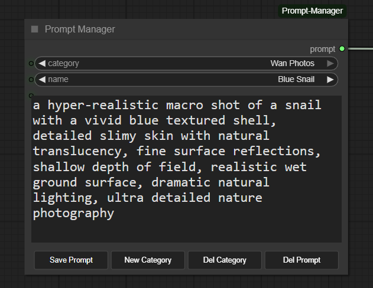

# ComfyUI Prompt Manager

**A custom [ComfyUI](https://github.com/comfyanonymous/ComfyUI) node for Organizing, Generating or Enhancing prompts.**

This addon started off as a simple prompt Manager, to help save and retrieve prompts.  
But has since evolved to be a complete toolset to help Generate prompts also.
***
Uses an existing install of [llama.cpp](https://github.com/ggerganov/llama.cpp), preventing install conflicts with ComfyUI.  
Provides options to automatically download Qwen3 and Qwen3VL models.  
Supports prompt enhancing, image analysis, or custom image processing, with up to 5 images at once.  
Custom GGUF models can be used if supported by llama.cpp; simply drop them in the models/gguf folder.  
Users can set a custom Llama-server path, if not defined in your System Path.

<div align="center">
  <figcaption>Simple Prompt Generator Usage</figcaption>
  
</div>


<div align="center">
  <figcaption>Advanced Prompt Generator Usage</figcaption>
  
</div>

### Key features:
### Prompt Manager:
- **Category Organization**: Create and manage multiple categories to organize your prompts
- **Save & Load Prompts**: Quickly save and recall your favorite prompts with custom names
- **LLM Input Toggle**: Connect text outputs from other nodes and toggle between using them or your internal prompts
- **LLM Input Toggle**: When in use, display of categories and prompt is disabled, allowing user to switch category and save.
- **Persistent Storage**: All prompts saved in your ComfyUI user folder

### Prompt Generator
- **Three Generation Modes**: Enhance text prompts, analyze images, or analyze images with custom instructions
- **Prompt Enhancement**: Transform basic prompts into detailed descriptions using local LLMs
- **Vision Analysis**: Analyze images with Qwen3VL models to generate detailed descriptions
- **Custom Image Analysis**: Provide your own instructions for image analysis
- **JSON Output**: Optional structured JSON output with scene breakdown
- **Thinking Support**: Support Thinking models to perform deeper generative reasoning.
- **Automatic Server Management**: Starts/stops llama.cpp server as needed, with automatic shut off at exit.
- **Smart Model Selection**: Auto-selects appropriate model (vision or text) based on mode or Thinking mode.
- **Model Preferences**: Set preferred models in ComfyUI preferences for automatic selection.
- **Custom Llama path**: In preferences you can set a custom Llama install Path, if not defined in your System Path.

### Prompt Generator Options
- **Model Selection**: Choose from local models or download Qwen3, Qwen3VL and Qwen3VL Thinking models from HuggingFace
- **Auto-Download**: Automatically downloads both model and required mmproj files for vision models
- **LLM Parameters**: Fine-tune temperature, top_k, top_p, min_p, repeat_penalty and context size.
- **Custom Instructions**: Override default system prompt for different enhancement styles.
- **Extra Image Inputs**:  Combine up to 5 images to generate your prompt.
- **Console Debugging**: Enable outputing the entire process to the console for debugging purposes.

## Installation

1. Navigate to your ComfyUI custom nodes directory:
   ```
   cd ComfyUI/custom_nodes/
   ```

2. Clone this repository:
   ```bash
   git clone https://github.com/FranckyB/ComfyUI-Prompt-Manager.git
   ```

3. Install dependencies:
   ```bash
   cd ComfyUI-Prompt-Manager
   pip install -r requirements.txt
   ```

4. Install llama.cpp. It can be found here: [llama.cpp install](https://github.com/ggml-org/llama.cpp/blob/master/docs/install.md)

5. If you have them, place your .gguf models in the models/gguf folder. (Create folder if not present)

6. Restart ComfyUI

## Usage

### Prompt Manager

1. **Add the Node**: Add Node → Prompt Manager
2. **Select a Category**: Use the dropdown to choose from your categories
3. **Choose a Prompt**: Select a saved prompt from the name dropdown
4. **Connect prompt output**: Connect Prompt Manager output to your clip text encode node.


### Prompt Generator

**Basic Usage** (assuming a model is present in models\gguf):
1. **Add the Node**: Add Node → Prompt Generator
2. **Select Mode**: Choose from:
   - "Enhance User Prompt" - Improve text prompts with LLM
   - "Analyze Image" - Generate detailed image descriptions
   - "Analyze Image with Prompt" - Analyze images with custom instructions
3. **Connect inputs**: Connect image for vision modes, or just use text for enhancement mode
4. **Output as Json**: Use Format_as_Json to experiment with Json prompts.
5. **Push the LLM**: Use enable_thinking to enable the model to perform deeper generative reasoning before producing the final prompt.
4. **Save memory**: Toggle "stop_server_after" ON to free VRAM after generation
5. **Run Workflow**: Generated prompt displays and can be saved to Prompt Manager

**Advanced Usage**:
1. **Add the Options Node**: Add Node → Prompt Generator Options
2. **Connect Options**: Connect the options node to the Prompt Generator Options input
3. **Analyze multiple images**: Connect up to 4 additional images, for a total of 5.
4. **Select from available models**: Select from models found in your models\gguf folder. Qwen models will be available to download.
5. **Adjust settings**: Adjust LLM parameters (temperature, top_k, etc.)
6. **Customize LLM**: Customize the default LLM instructions to modify the responses llama returns.
7. **Enable Debugging**: Enable complete printout of process to console using show_everything_in_console

**Qwen models found in options**
- Qwen3-1.7B-Q8_0.gguf: Fastest, lowest VRAM (~2GB)
- Qwen3-4B-Q8_0.gguf:   Balanced performance (~4GB VRAM)
- Qwen3-8B-Q8_0.gguf:   Best quality, highest VRAM (~8GB)
- Qwen3VL-4B-Instruct-Q8_0.gguf: Vision model, balanced performance (~5GB VRAM)
- Qwen3VL-8B-Instruct-Q8_0.gguf: Vision model, best quality (~9GB VRAM)
- Qwen3VL-4B-Thinking-Q8_0.gguf: Vision model, Thinking variant, balanced performance (~5GB VRAM)
- Qwen3VL-8B-Thinking-Q8_0.gguf: Vision model, Thinking variant, best quality (~9GB VRAM)

**Model Management**:
- Place gguf files in models/gguf folder
- Downloaded models are also placed in this folder.

**Model Preferences**:
- Set preferred models in ComfyUI Settings → Prompt Manager → Model Preferences
- **Preferred Base Model**: Used for "Enhance User Prompt" mode (text-only models)
- **Preferred Vision Model**: Used for "Analyze Image" modes (Qwen3VL models)
- Leave empty to auto-select smallest available model
- Changes are saved automatically in ComfyUI settings

## Requirements

- ComfyUI
- Python 3.8+
- requests >= 2.31.0
- huggingface_hub >= 0.20.0
- psutil >= 5.9.0
- tqdm >= 4.66.0
- Pillow >= 10.0.0
- llama-server (from llama.cpp)

## Troubleshooting

**Problem**: Prompts don't appear in the dropdown
- **Solution**: Make sure the category has saved prompts. Try creating a new prompt first.

**Problem**: Changes aren't saved
- **Solution**: Click the "Save Prompt" button after making changes. Direct edits in the text field are temporary.

**Problem**: Can't see LLM output in the node
- **Solution**: Make sure the LLM output is connected to the "llm_input" and run the workflow.

**Problem**: "llama-server command not found"
- **Solution**: Install llama.cpp and make sure `llama-server` is available in command line. See [llama.cpp releases](https://github.com/ggerganov/llama.cpp/releases)

**Problem**: "No models found"
- **Solution**: Either place a .gguf file in the `models/` folder, or connect the Prompt Generator Option node and select a model size (1.7B, 4B, or 8B) to download from HuggingFace

**Problem**: Server won't start
- **Solution**: Check that port 8080 is not in use. Close any existing llama-server processes.

**Problem**: Model download fails
- **Solution**: Check your internet connection and HuggingFace availability. Large models may take time to download.

**Problem**: Generation is slow
- **Solution**: Either, Use a smaller quantized model (Q4 instead of Q8) or toggle 'stop_server_after' to quit llama.cpp after generating prompt.

**Problem**: Default Model used is not what I want
- **Solution**: You can set your preferred model in the ComfyUI settings. Simply add its full name for both the VL and base models. Enabling Thinking in the Generator might change what is used.

## Changelog

### Version 1.8.1
- Added option to set a custom Llama path in preferences, for those that have specific installs.

### Version 1.8.0
- Added support for Qwen3VL Thinking model variants, with download options thru the Generator Options node.
- Model manager now searches for relevant `mmproj` files using model-name components for more reliable vision-model linking.
- Detailed console output options (debug logging)
- `enable_thinking` toggle to enable/disable the model's reasoning/thinking mode.
- Options node now accepts multiple images for analysis.
- Better Llama shutdown behavior to force-close the server when Comfy exits.
- Uses model-reported sampling params by default when available; the Options node can override them per-parameter.
- Moved preference API endpoints and cache handling into `model_manager.py` for cleaner management and persistence.

### Version 1.7.0
- Added three-mode prompt generator: "Enhance User Prompt", "Analyze Image", "Analyze Image with Prompt"
- Enhanced vision model workflow with dedicated image analysis modes
- Added custom image analysis with user-provided instructions (e.g., "describe the lighting", "identify objects")
- Added model preferences system integrated with ComfyUI Settings
- Added automatic model preference management (separate settings for base and vision models)
- Improved model selection with preference fallback to smallest model
- Filtered mmproj files from model selection dropdowns
- Model preferences stored in ComfyUI settings for persistence across updates

### Version 1.6.0
- Added Qwen3VL vision model support for image analysis
- Added JSON output format option with structured scene breakdown
- Added adjustable context size parameter (512-32768 tokens)
- Added automatic mmproj file download for vision models
- Added image resizing to ~2MP to optimize token usage
- Added token usage logging for monitoring context consumption
- Improved model selection logic with automatic VL/non-VL detection
- Fixed multiple directory support for model search (gguf + LLM folders)

### Version 1.5.1
- LLM output remains available when use_llm is off, so it can be edited.
- Improved caching detection: any change to options will be detected and force a new output.
- Improved some UI quirks

### Version 1.5.0
- Added Prompt Generator node with automatic llama.cpp server management
- Added Prompt Generator Options node for model selection and parameters
- Automatic model detection and auto-download from HuggingFace for Qwen3 models.
- VRAM management with optional server shutdown

### Version 1.1.0
- Added LLM input toggle for switching between internal and external text
- Made text fields scrollable even when disabled
- Fixed reload bugs with toggle state

### Version 1.0.0
- Initial release
- Category and prompt management
- LLM output integration
